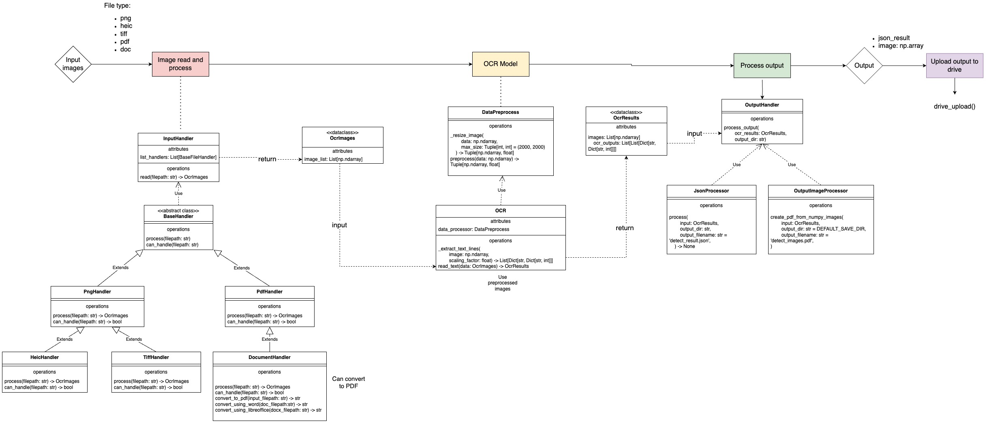

# Homework Week 1: OCR App

## Introduction

This is an OCR app that could read all document and images and extract the texts and their corresponding locations in a json file. This app is helpful for information extraction to digital formats, making them easier to store, search, and manage. This app can support different input file types, such as: ``.png``, ``.heic``, ``.tiff``, ``.pdf``, ``.doc``, ``.docx``.

This app utilizes different tech stacks:
- **Read images/docs**: mimetypes, pillow, pillow-heif, PyMuPDF
- **Preprocess images**: numpy
- **Text detection**: opencv-python
- **Text extraction**: pytesseract
- **Save and store outputs**: os, json

## App design

### Workflow
1. Image read and preprocessing:
- The system accepts various file types (png, heic, tiff, pdf, doc) as input images.
- The InputHandler reads the file and delegates processing to the appropriate file handler based on the file type. The selected handler processes the file and converts it into an OcrImages object containing preprocessed image data.
- DataPreprocess resizes and preprocesses the images to prepare them for OCR.

2. OCR Model:
- The OCR class uses the preprocessed images to extract text lines and generate OcrResults.

3. Output Handling:
- OutputHandler processes the OCR results.
- The JsonProcessor and OutputImageProcessor handle converting the OCR results to JSON and PDF formats, respectively.

4. Uploading:
The processed output (JSON and/or PDF) is uploaded to a drive using the drive_upload function.

## Set up
How to use (ex: create virtual env, install requirements, command line, etc.)
